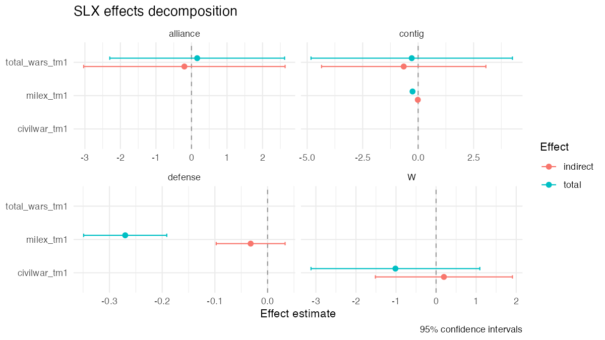

# slxr

<!-- badges: start -->
<!-- badges: end -->

**Spatial-X (SLX) models for applied researchers.**

`slxr` makes it easy to fit, interpret, and visualize Spatial-X regression
models in R. Unlike existing tools that treat SLX as a consolation prize for
SAR, `slxr` centers the SLX approach and provides first-class support for the
features applied researchers actually need:

- Formula-based interface — write `slx(y ~ x1 + x2, data, W, lag = "x1")`
  and get a fitted model, not a wrestling match with `listw` objects.
- **Variable-specific weights matrices** — the defining feature of
  Wimpy, Whitten, and Williams (2021). Different covariates can spill over
  through different `W` matrices (contiguity, alliance, trade, etc.) in a
  single model.
- Higher-order spatial lags (`W`, `W²`, `W³`) with clean effects decomposition.
- Temporally-lagged spatial variables (TSLS) for panel data.
- Tidy direct, indirect, and total effects — for SLX these don't require
  matrix inversion or simulation.
- `modelsummary`-compatible output (via `tidy()` and `glance()` methods).
- Sensible defaults plus diagnostics for comparing `W` specifications.

## Installation

```r
# Development version
# install.packages("remotes")
remotes::install_github("cwimpy/slxr")
```

## Example

```r
library(slxr)
data(defense_burden)   # 1995 cross-section from Wimpy et al. (2021)

W_contig   <- slx_weights(style = "custom", matrix = defense_burden$W_contig,
                          row_standardize = FALSE)
W_alliance <- slx_weights(style = "custom", matrix = defense_burden$W_alliance,
                          row_standardize = FALSE)
W_defense  <- slx_weights(style = "custom", matrix = defense_burden$W_defense,
                          row_standardize = FALSE)

fit <- slx(
  ch_milex ~ milex_tm1 + log_pop_tm1 + civilwar_tm1 + total_wars_tm1 +
             alliance_us + ch_milex_us + ch_milex_ussr,
  data = defense_burden$data,
  spatial = list(
    civilwar_tm1   = W_contig,
    total_wars_tm1 = list(contig = W_contig, alliance = W_alliance),
    milex_tm1      = list(contig = W_contig, defense  = W_defense)
  )
)

slx_effects(fit)
slx_plot_effects(fit, types = c("indirect", "total"))
```



Variable-specific weights matrices:

```r
fit <- slx(defense ~ civil_war + interstate_war + defense_lag,
           data = df,
           spatial = list(
             civil_war      = W_contig,
             interstate_war = W_contig,
             defense_lag    = list(W_contig, W_pact)
           ))
```

## Status

Early development. The MVP covers single-W SLX estimation, effects
decomposition, and `modelsummary` integration. Multi-W, higher-order,
temporal, and plotting features are on the roadmap.

## References

Wimpy, C., Whitten, G. D., & Williams, L. K. (2021). X Marks the Spot:
Unlocking the Treasure of Spatial-X Models. *Journal of Politics*, 83(2),
722–739. [doi:10.1086/710089](https://doi.org/10.1086/710089)

Vega, S. H., & Elhorst, J. P. (2015). The SLX Model. *Journal of Regional
Science*, 55(3), 339–363.

LeSage, J. P., & Pace, R. K. (2009). *Introduction to Spatial Econometrics*.
Chapman & Hall/CRC.
