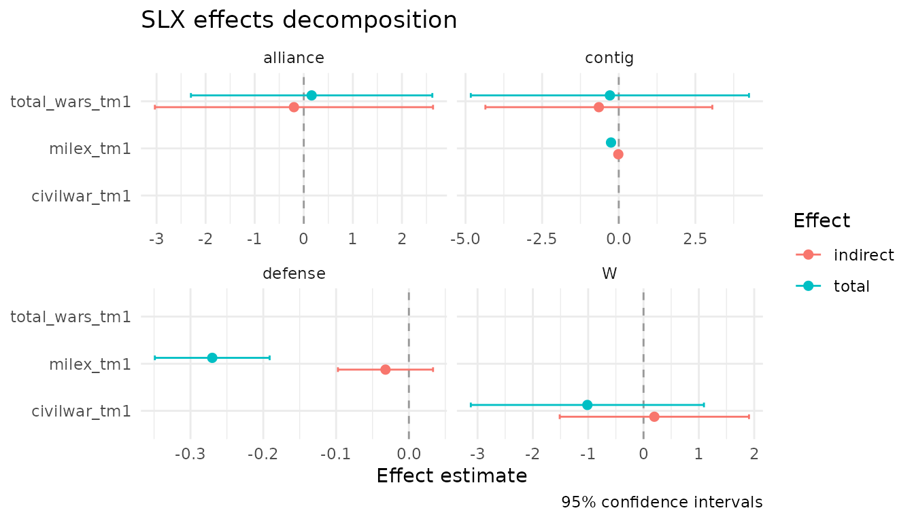

# Getting started with slxr

## The Spatial-X model

The Spatial-X (SLX) model has the form

$$y = X\beta + WX\theta + \varepsilon,$$

where `W` is a spatial weights matrix and `WX` adds spatially-lagged
versions of selected regressors. Wimpy, Whitten, and Williams (2021)
argue that the SLX specification more faithfully reflects typical
political science theories than the more common SAR model, and is much
easier to estimate and interpret: it is plain OLS on an augmented design
matrix.

`slxr` exists because the mechanics of building `W`, multiplying it by
the right columns of `X`, and reporting direct/indirect/total effects
cleanly is more friction than applied researchers should have to endure.

## The example dataset

The package ships with `defense_burden`, a 1995 cross-section of 179
countries drawn from the replication archive of Wimpy, Whitten, and
Williams (2021). The data include change in military expenditures (the
outcome), lagged covariates, and three row-standardized spatial weights
matrices encoding different channels of international connectivity.

``` r
library(slxr)
data(defense_burden)

names(defense_burden)
#> [1] "data"       "W_contig"   "W_alliance" "W_defense"
dim(defense_burden$data)
#> [1] 179  12
dim(defense_burden$W_contig)
#> Loading required namespace: Matrix
#> NULL
```

`defense_burden$data` is a tibble with country-level observations.
`defense_burden$W_contig`, `$W_alliance`, and `$W_defense` are sparse
weights matrices connecting those countries through geographic
contiguity, alliance ties, and mutual defense pacts, respectively.

## Fitting an SLX model with a single W

The simplest case: one weights matrix, one lagged variable. We lag only
`total_wars_tm1` through contiguity, so the indirect effect captures the
spillover from interstate wars in neighboring countries.

``` r
W_contig <- slx_weights(style = "custom",
                        matrix = defense_burden$W_contig,
                        row_standardize = FALSE)

fit <- slx(ch_milex ~ milex_tm1 + log_pop_tm1 + civilwar_tm1 +
                      total_wars_tm1 + alliance_us +
                      ch_milex_us + ch_milex_ussr,
           data = defense_burden$data,
           W = W_contig,
           lag = "total_wars_tm1")

summary(fit)
#> Spatial-X (SLX) model summary
#> n = 179    R^2 = 0.416    adj R^2 = 0.396 
#> 
#>                   Estimate Std. Error  t value Pr(>|t|)    
#> (Intercept)       0.242197   0.479381   0.5052  0.61405    
#> milex_tm1        -0.245628   0.023712 -10.3586  < 2e-16 ***
#> log_pop_tm1       0.043155   0.055538   0.7770  0.43820    
#> civilwar_tm1     -1.232301   0.582912  -2.1140  0.03595 *  
#> total_wars_tm1    0.385103   0.899151   0.4283  0.66897    
#> alliance_us      -0.407637   0.249121  -1.6363  0.10361    
#> W.total_wars_tm1 -0.740396   1.566531  -0.4726  0.63707    
#> ---
#> Signif. codes:  0 '***' 0.001 '**' 0.01 '*' 0.05 '.' 0.1 ' ' 1
#> 
#> Spatial lag terms:
#>        variable w_name order time_lag          colname
#>  total_wars_tm1      W     1        0 W.total_wars_tm1
```

The `W.total_wars_tm1` row is the spatial spillover. To get a clean
direct/indirect/total decomposition:

``` r
slx_effects(fit)
#> # A tibble: 3 × 8
#>   variable       w_name type     estimate std.error conf.low conf.high p.value
#>   <chr>          <chr>  <chr>       <dbl>     <dbl>    <dbl>     <dbl>   <dbl>
#> 1 total_wars_tm1 NA     direct      0.385     0.899    -1.39      2.16   0.669
#> 2 total_wars_tm1 W      indirect   -0.740     1.57     -3.83      2.35   0.637
#> 3 total_wars_tm1 W      total      -0.355     1.65     -3.61      2.89   0.829
```

For SLX these effects are a simple function of OLS coefficients and
their variance-covariance matrix - no matrix inversion, no simulation.

## Variable-specific weights matrices

The defining feature of Wimpy, Whitten, and Williams (2021) is that
different covariates can spill over through different `W` matrices.
Civil wars spread through geography; alliance ties produce joint
responses to interstate conflict; defense-pact partners coordinate
military spending. All three mechanisms can sit in a single model.

``` r
W_alliance <- slx_weights(style = "custom",
                          matrix = defense_burden$W_alliance,
                          row_standardize = FALSE)
W_defense  <- slx_weights(style = "custom",
                          matrix = defense_burden$W_defense,
                          row_standardize = FALSE)

fit_multi <- slx(
  ch_milex ~ milex_tm1 + log_pop_tm1 + civilwar_tm1 +
             total_wars_tm1 + alliance_us +
             ch_milex_us + ch_milex_ussr,
  data = defense_burden$data,
  spatial = list(
    civilwar_tm1   = W_contig,
    total_wars_tm1 = list(contig = W_contig, alliance = W_alliance),
    milex_tm1      = list(contig = W_contig, defense  = W_defense)
  )
)

slx_effects(fit_multi)
#> # A tibble: 13 × 8
#>    variable       w_name   type   estimate std.error conf.low conf.high  p.value
#>    <chr>          <chr>    <chr>     <dbl>     <dbl>    <dbl>     <dbl>    <dbl>
#>  1 civilwar_tm1   NA       direct  -1.21      0.597   -2.39     -0.0323 4.41e- 2
#>  2 total_wars_tm1 NA       direct   0.360     1.08    -1.78      2.50   7.40e- 1
#>  3 milex_tm1      NA       direct  -0.238     0.0254  -0.288    -0.188  5.34e-17
#>  4 civilwar_tm1   W        indir…   0.196     0.866   -1.52      1.91   8.22e- 1
#>  5 milex_tm1      contig   indir…  -0.0148    0.0336  -0.0811    0.0516 6.61e- 1
#>  6 milex_tm1      defense  indir…  -0.0321    0.0331  -0.0974    0.0332 3.33e- 1
#>  7 total_wars_tm1 alliance indir…  -0.200     1.44    -3.03      2.63   8.89e- 1
#>  8 total_wars_tm1 contig   indir…  -0.649     1.88    -4.35      3.05   7.30e- 1
#>  9 civilwar_tm1   W        total   -1.01      1.07    -3.12      1.09   3.43e- 1
#> 10 total_wars_tm1 contig   total   -0.289     2.30    -4.83      4.25   9.00e- 1
#> 11 total_wars_tm1 alliance total    0.160     1.25    -2.30      2.62   8.98e- 1
#> 12 milex_tm1      contig   total   -0.253     0.0355  -0.323    -0.183  2.97e-11
#> 13 milex_tm1      defense  total   -0.270     0.0399  -0.349    -0.191  2.12e-10
```

Here `total_wars_tm1` and `milex_tm1` each produce two indirect
effects - one through each spatial channel - so the decomposition
separates spillovers from geographically-contiguous neighbors from those
transmitted through alliances or defense pacts.

## Visualization

``` r
library(ggplot2)
slx_plot_effects(fit_multi, types = c("indirect", "total"))
```



The plot facets automatically by weights matrix name when a variable is
lagged through multiple `W` channels, so the per-channel spillover
patterns are visible side-by-side.

## broom and modelsummary integration

``` r
tidy(fit_multi)
glance(fit_multi)

modelsummary::modelsummary(
  list("Contiguity only" = fit, "Multi-W" = fit_multi),
  statistic = "conf.int"
)
```

## Caveats

This vignette uses a single cross-section from 1995 because the current
release of `slxr` does not yet support block-diagonal panel `W`
matrices. A full-panel replication of Wimpy, Whitten, and Williams
(2021) Table 3, Model 3 is planned for v0.2 alongside TSLS support.

## References

Wimpy, C., Whitten, G. D., & Williams, L. K. (2021). X Marks the Spot:
Unlocking the Treasure of Spatial-X Models. *Journal of Politics*,
83(2), 722-739.
