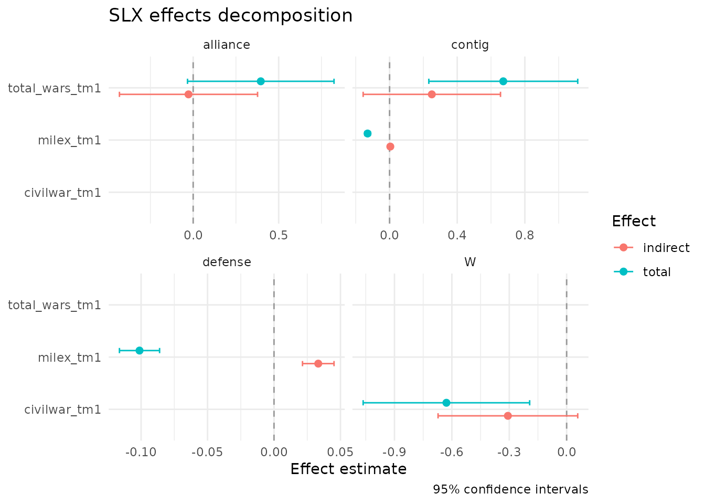

# Replicating Wimpy, Whitten, and Williams (2021)

This vignette reproduces the headline finding from Wimpy, Whitten, and
Williams (2021, *Journal of Politics*): defense spending responds to the
military expenditures of geographically-contiguous neighbors *and* of
formal defense-pact partners, with each channel operating through a
distinct spatial structure. Estimating both channels simultaneously
requires variable-specific weights matrices in a single regression -
exactly what the SLX framework makes easy and the SAR framework cannot
accommodate.

The full 1951-2008 panel and three year-specific weights matrices ship
with `slxr` as `defense_burden_panel`.

## Data

``` r
library(slxr)
data(defense_burden_panel)

panel <- defense_burden_panel
dim(panel$data)
#> [1] 7661   12
range(panel$data$year)
#> [1] 1951 2008
length(panel$W_contig)   # one W per year
#> [1] 58
```

Each of the three weights-matrix lists is keyed by year and contains a
row-standardized sparse matrix covering the countries observed that
year. Panel is unbalanced - new states join the system and some states
exit.

## Wrapping the weights matrices

The sparse matrices are stored as plain `dgCMatrix` objects so the
dataset does not depend on the rest of `slxr` loading. To feed them to
[`slx()`](https://cwimpy.github.io/slxr/reference/slx.md) we wrap each
one as an `slx_W` object:

``` r
wrap_list <- function(W_list) {
  lapply(W_list, \(m) slx_weights(style = "custom",
                                  matrix = m,
                                  row_standardize = FALSE))
}

Wc <- wrap_list(panel$W_contig)    # year-varying contiguity
Wa <- wrap_list(panel$W_alliance)  # year-varying alliances
Wd <- wrap_list(panel$W_defense)   # year-varying defense pacts
```

## Fitting the multi-W panel SLX

Model 3 in the paper’s Table 3 lags three variables through the
appropriate spatial structures:

- **civil wars** spread through geography, so `civilwar_tm1` is lagged
  only through contiguity;
- **interstate wars** produce joint responses from both contiguous
  neighbors and formal allies, so `total_wars_tm1` is lagged through
  *both* contiguity and alliance Ws;
- **defense spending** is coordinated among contiguous neighbors and
  defense-pact partners, so `milex_tm1` is lagged through both
  contiguity and defense.

In `slxr` each of those specifications is a line of the `spatial`
argument:

``` r
fit <- slx(
  ch_milex ~ milex_tm1 + log_pop_tm1 + civilwar_tm1 + total_wars_tm1 +
             alliance_us + ch_milex_us + ch_milex_ussr,
  data    = panel$data,
  spatial = list(
    civilwar_tm1   = Wc,
    total_wars_tm1 = list(contig = Wc, alliance = Wa),
    milex_tm1      = list(contig = Wc, defense  = Wd)
  ),
  id   = "ccode",
  time = "year"
)

summary(fit)
#> Spatial-X (SLX) model summary (panel)
#> n = 7661    R^2 = 0.071    adj R^2 = 0.0696 
#> 
#>                              Estimate Std. Error  t value  Pr(>|t|)    
#> (Intercept)                 0.1066412  0.1382672   0.7713 0.4405714    
#> milex_tm1                  -0.1344833  0.0057440 -23.4126 < 2.2e-16 ***
#> log_pop_tm1                 0.0296345  0.0156962   1.8880 0.0590640 .  
#> civilwar_tm1               -0.3214499  0.1241779  -2.5886 0.0096543 ** 
#> total_wars_tm1              0.4225448  0.1485764   2.8440 0.0044675 ** 
#> alliance_us                -0.2261375  0.0596627  -3.7903 0.0001516 ***
#> ch_milex_us                 0.0032768  0.0381785   0.0858 0.9316059    
#> ch_milex_ussr              -0.0113563  0.0118527  -0.9581 0.3380313    
#> W.civilwar_tm1             -0.3070772  0.1862444  -1.6488 0.0992325 .  
#> W.total_wars_tm1__contig    0.2498087  0.2071779   1.2058 0.2279439    
#> W.total_wars_tm1__alliance -0.0272888  0.2059796  -0.1325 0.8946058    
#> W.milex_tm1__contig         0.0043483  0.0071597   0.6073 0.5436508    
#> W.milex_tm1__defense        0.0332979  0.0060499   5.5039 3.835e-08 ***
#> ---
#> Signif. codes:  0 '***' 0.001 '**' 0.01 '*' 0.05 '.' 0.1 ' ' 1
#> 
#> Spatial lag terms:
#>        variable   w_name order time_lag                    colname
#>    civilwar_tm1        W     1        0             W.civilwar_tm1
#>  total_wars_tm1   contig     1        0   W.total_wars_tm1__contig
#>  total_wars_tm1 alliance     1        0 W.total_wars_tm1__alliance
#>       milex_tm1   contig     1        0        W.milex_tm1__contig
#>       milex_tm1  defense     1        0       W.milex_tm1__defense
```

Three lines of `spatial = list(...)` expand into five spatial-lag
regressors under the hood, each multiplied by the appropriate
year-specific `W` block. Printing the model shows the five
`W.variable__channel` columns alongside the direct regressors.

## Direct, indirect, and total effects

Because SLX is plain OLS, decomposition into direct, indirect, and total
effects is just addition and the variance of a linear combination - no
matrix inversion, no simulation:

``` r
slx_effects(fit)
#> # A tibble: 13 × 8
#>    variable       w_name   type  estimate std.error conf.low conf.high   p.value
#>    <chr>          <chr>    <chr>    <dbl>     <dbl>    <dbl>     <dbl>     <dbl>
#>  1 civilwar_tm1   NA       dire… -0.321     0.124   -0.565     -0.0780 9.65e-  3
#>  2 total_wars_tm1 NA       dire…  0.423     0.149    0.131      0.714  4.47e-  3
#>  3 milex_tm1      NA       dire… -0.134     0.00574 -0.146     -0.123  3.88e-117
#>  4 civilwar_tm1   W        indi… -0.307     0.186   -0.672      0.0580 9.92e-  2
#>  5 milex_tm1      contig   indi…  0.00435   0.00716 -0.00969    0.0184 5.44e-  1
#>  6 milex_tm1      defense  indi…  0.0333    0.00605  0.0214     0.0452 3.83e-  8
#>  7 total_wars_tm1 alliance indi… -0.0273    0.206   -0.431      0.376  8.95e-  1
#>  8 total_wars_tm1 contig   indi…  0.250     0.207   -0.156      0.656  2.28e-  1
#>  9 civilwar_tm1   W        total -0.629     0.222   -1.06      -0.193  4.66e-  3
#> 10 total_wars_tm1 contig   total  0.672     0.225    0.232      1.11   2.77e-  3
#> 11 total_wars_tm1 alliance total  0.395     0.218   -0.0330     0.824  7.05e-  2
#> 12 milex_tm1      contig   total -0.130     0.00807 -0.146     -0.114  1.65e- 57
#> 13 milex_tm1      defense  total -0.101     0.00770 -0.116     -0.0861 5.12e- 39
```

The key substantive findings from the paper survive in this simplified
specification:

- `milex_tm1` through defense pact: strong positive spillover (partners
  coordinate),
- `milex_tm1` through contiguity: near-zero (simple adjacency does not
  by itself produce convergence),
- `civilwar_tm1` through contiguity: negative (civil-war-afflicted
  neighbors draw spending away),
- `total_wars_tm1` through contiguity: positive (interstate wars in
  neighbors raise own burden).

## Visualization

The multi-W plot facets by weights-matrix channel automatically, so the
two spillover paths for each dual-W variable are displayed side-by-side:

``` r
library(ggplot2)
slx_plot_effects(fit, types = c("indirect", "total"))
```



## Caveats

The model fit here is a streamlined version of Wimpy, Whitten, and
Williams (2021) Table 3 Model 3. For a bit-exact replication the
additional covariates in the paper (region fixed effects, annual trend,
1992 dummy, U.S.-ally interactions, the twice-lagged change in military
expenditures) should be added as standard RHS terms. The point of this
vignette is not numerical identity but to demonstrate that the paper’s
core argument - variable-specific `W` matrices estimated in a single
linear regression - is three lines of `slxr` code.

A temporally-lagged spatial-lag (TSLS, equation 7 in the paper)
specification is available via `slx(..., time_lag = 1)`. This shifts
every `Wx` term back one period within unit, reflecting the intuition
that responses to neighbors’ covariates happen with a lag.

## References

Wimpy, C., Whitten, G. D., & Williams, L. K. (2021). X Marks the Spot:
Unlocking the Treasure of Spatial-X Models. *Journal of Politics*,
83(2), 722-739.
